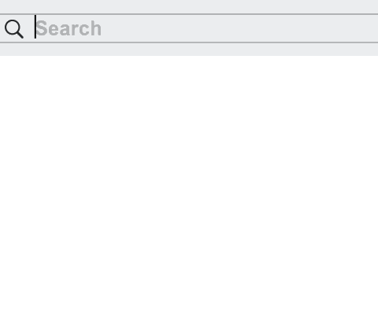

<p align="center">
    
    
    
    
    <a href="https://github.com/SerhiyButz/SearchQueryParser/blob/master/LICENSE">
        
    </a>
</p>

# SearchQueryParser

`SearchQueryParser` is a simple Google-like search-engine-query [parser](https://en.wikipedia.org/wiki/Parsing#Parser) (and marker) for Swift. It takes a search string and builds its [abstract syntax tree](https://en.wikipedia.org/wiki/Abstract_syntax_tree). This package is applicable for use with Apple's [Search Kit](https://developer.apple.com/documentation/coreservices/search_kit) for highlighting of found results.



## Features

- Scannerless (lexerless)
- Boolean-like syntax support (AND ("&"), OR ("|"), NOT ("!") logical operators)
- Prefix and suffix wildcards ("*")
- Phrase searches
- Tolerant to search query syntax errors
- Provides facilities to locate search terms within an input text

## Search query grammar

Backus–Naur form (BNF):

```
Query = Sweeping-Mute-And-Term, ⧚’?, EOF ;
Sweeping-Mute-And-Term = Mute-And-Term, { ⧚’?, Mute-And-Term }* ;
Mute-And-Term = Or-Term, Or-Term* ;
Or-Term = And-Term, {⧚?, (‘|’ | “OR”), And-Term }* ;
And-Term = Not-Term, {⧚?, (‘&’ | “AND”), Not-Term }* ;
Not-Term = ⧚?, (’!’ | “NOT”), Not-Term | Primary-Term ;
Primary-Term = ⧚?, ’(‘ ⧚?, Mute-And-Term, ⧚? ‘)’ |
               ⧚?, “‘“ ⧚?, Phrase, ⧚? “‘“ |
               ⧚?, Prefix-Wildcard-Search-Term |
               ⧚?, Suffix-Wildcard-Search-Term |
               ⧚?, Search-Term ;
Phrase = Search-Term, { ⧚, Search-Term }* ;
Prefix-Wildcard-Search-Term = ‘*’, Search-Term ;
Suffix-Wildcard-Search-Term = Search-Term, ‘*’ ;
Search-Term = Letter | Letter, Search-Term ;
Letter = Alpha | Digit | ‘_’ ;
⧚’ = ⧚-(“*” | “!” | “&” | “(“ | “)” | “\””)
⧚ = { ? any-character ?-Letter }+ ;
Alpha = ? alpha-character ? ;
Digit = "0" | "1" | "2" | "3" | "4" | "5" | "6" | "7" | "8" | "9" ;
```

## Use cases

### Print out a search query's abstract syntax tree
```swift
import SearchQueryParser

func printQueryAST(_ query: String) {
    guard let parser = SearchQueryParser(query), let ast = parser.astRoot
    else {
        print("Couldn't parse")
        return
    }
    print("AST: \(ast)")
}

printQueryAST("foo bar")
```

### Highlight search query matches
```swift
import SearchQueryParser

func highlightSearchQueryMatches(query: String, in text: NSMutableAttributedString) {
    guard let queryTerms = SearchQueryParser(query)
    else {
        print("No matches found")
        return
    }
    let tokensProvider = SearchTextScanner(text.string)
    guard let applicator = SearchQueryApplicator(searchQueryTerms: queryTerms,
                                                 textTokens: tokensProvider)
    else {
        print("Nothing was marked")
        return
    }
    applicator.markedRanges.forEach { range in
        text.addAttribute(.backgroundColor, value: NSColor.yellow, range: range)
    }
}
let text = NSMutableAttributedString(string: "Lorem ipsum ...")
highlightSearchQueryMatches(query: "foo & bar", in: text)
```

## Installation

### Swift Package as dependency in Xcode 11+

1. Go to "File" -> "Swift Packages" -> "Add Package Dependency"
2. Paste Search Query Parser repository URL into the search field:

`https://github.com/SerhiyButz/SearchQueryParser.git`

3. Click "Next"

4. Ensure that the "Rules" field is set to something like this: "Version: Up To Next Major: 1.3.0"

5. Click "Next" to finish

For more info, check out [here](https://developer.apple.com/documentation/xcode/adding_package_dependencies_to_your_app).

### CocoaPods

[CocoaPods]: http://cocoapods.org

Add the following to your [Podfile](http://guides.cocoapods.org/using/the-podfile.html):

```ruby
platform :osx, '10.12'

target 'YOUR-TARGET' do
  use_frameworks!
  pod 'SearchQueryParser', :git => 'https://github.com/SerhiyButz/SearchQueryParser.git'
end
```

Then run `pod install`.

## License

This project is licensed under the MIT license.
